# O que é aprendizagem por reforço?

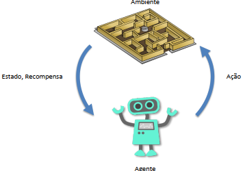

É um tipo de aprendizagem em que um AGENTE deve atingir um OBJETIVO estabelecido por meio de interações com um dado AMBIENTE. Ele iniciará o seu processo de aprendizagem efetuando AÇÕES aleatórias dentro desse ambiente, a cada mudança de ESTADO ele receberá uma RECOMPENSA NEGATIVA OU POSITIVA até que através dos seus ERROS e ACERTOS ele alcance o objetivo em questão.

# Equação de Bellman

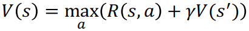

* V(s): Valor para estar em um determinado estado
* R(s,a): Dada uma ação "a" vai para um estado "s" e ganha uma recompensa "R". Em outras palavras, recompensas que o agente ganhará por se movimentar em um determinado estado.
* max.a: Máximo de "a". O agente executa a ação (a) em lhe proporcione um estado com maior valor.
* V(s'): Valor para estar em um estado seguinte
* s': Estado seguinte
* s: Estado atual
* a: Ação
* R: Recompensa
* γ:gamma: Fator de desconto

# Exemplo de cálculo de γV(S') da Equação de Bellman

Ínicio em V=1, pois se o agente se deslocar para a direita a recompensa nesse estudo de caso será +1.

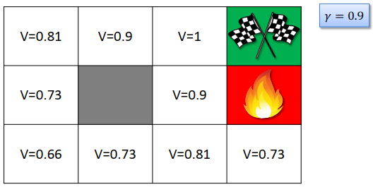

# Plano

Com base no cálculo de γV(S'), será criado um plano para que o agente possa executar suas ações, ele seguirá sempre para os estados com maior valor.

# Markov Decision Process (MDP)

Markov Decision Processes (MDPs - Processos de Decisão de Markov) fornecem uma estrutura matemática para modelar a tomada de decisões em situações onde os resultados são parcialmente aleatórios e parcialmente sob o controle de um tomador de decisão.

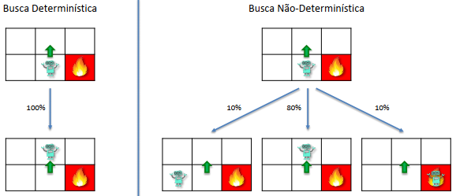

* Busca determinística
* * Quando descidir ir para um determinado estado, a chande dele ir para esse estado é de 100%
* Busca não determinística
* * A mudança de estado é baseada em probabilidade (estocástica)

# Para a busca não determinística acrescenta-se as probabilidade de Markov na equação de Bellman

Esse adendo é feito porque não se sabe qual estado será selecionado. Pois, por maior que seja a probabilidade de seguir para um determinado estado, pode ser que o agente precise ir para os outros estados que tenham um probabilidade menor.

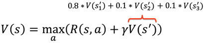

Com esse adendo a equação de Bellman escreve-se

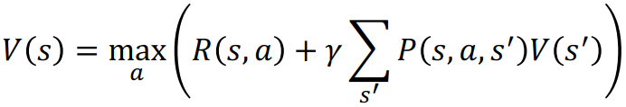

* P(s,a,s'): Probabilidade de estar em "s" tomando a ação "a" e estar no estado "s'"
* V(s'): Estado futuro

# Política x Plano

Na busca não determínistica estocástica, não há um plano em que o agente sabe o caminho passo a passo, pois existe o fator randômico. Na busca determinística o estado próximo ao objetivo é 100%, ou seja o agende terá 100% de chance de atingir o objetivo quando chegar nesse estado. Já na busca não determinística o estado próximo ao objetivo não é 100% e desse modo ele poderá decidir não atingir o objetivo devido ao fato randômico.

# Living Penalty

É adicionada uma recompensa negativa (penalidade) nas mudanças de estados (pode ser a cada estado ou outras definições escolhidas), quanto mais tempo o agente permanecer no ambiente mais recompensas negativas ele receberá. Isso é um insentivo para que o agente não fique parado em um estado sem chegar a lugar algum e se arrisque mudando suas ações no ambiente para então chegar no objetivo o quanto antes.

# Q-Learning Intuição

O Q define a qualidade da ação, semalhante a uma métrica que indica qual ação é a melhor. É relacionado com a recompensa. O que o agente vai ganhar ao tomar uma determinada ação.

O valor de um estado V(s) é o máximo de todos os possíveis valores de Q. Para ser possível calcular o V(s) é necessário dos valores de Q. Na imagem é possível mudar para 4 estados V(s1), V(s2) e V(s3) e sendo assim é necessário ter os valores de Q(s0,a4), Q(s0,a1), Q(s0,a2) e Q(s0,a3).

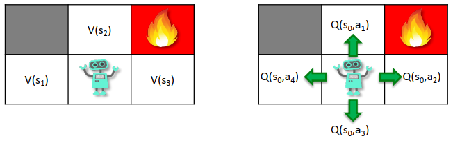

O agente executando uma ação no estado "s" obtém o valor de "Q"

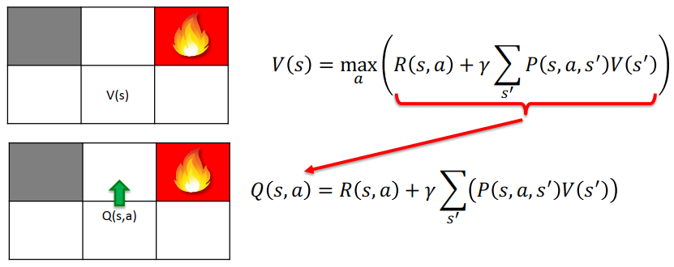
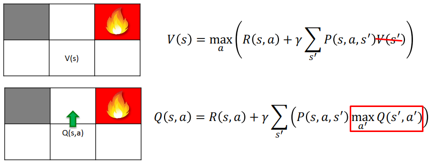

# Diferença Temporal

Atualização dos valores de Q. Cada vez que o agente muda de estado o valor que Q é atualizado. O objetivo nesse tipo de aprendizagem de máquina, utilizando esse algoritmo, é encontrar os melhores valores de Q assim como numa rede neural artificial o objetivo é encontrar os melhores valores dos pesos.

Uma boa convergência da rede é indicada pelo TD mais próximo possível de 0 e isso proporciona um número de ações mais consistentes para os agentes.

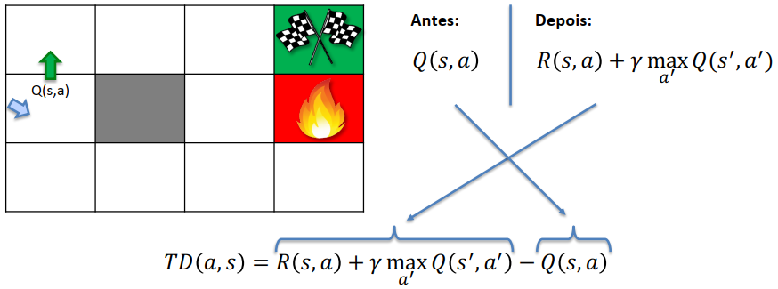
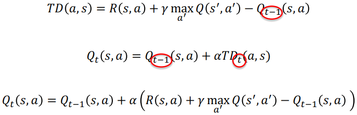

* TD(a,s): Diferença Temporal de uma ação (a) para um estado (s)
* α:alfa: Taxa de aprendizagem (Não é recomendável utilizar o valor 1 ou 0)

# Intuição Deep Q-Learning

A função de Diferença Temporal é substituída por uma deep network. O objetivo disso é aproximar o valor de Q com Q-Target atráves da função de perda. Ela que indicará qual será a melhor ação a ser tomada pela agente.

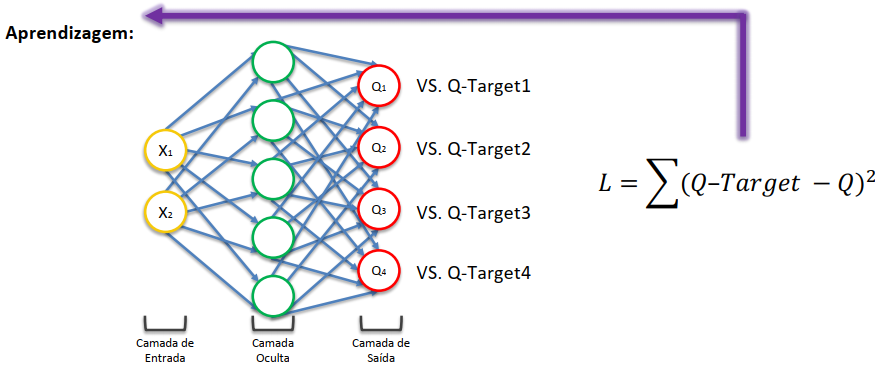

A função softmax retornará uma probabilidade, a soma de todas as saídas é 100%, o agente escolherá a saída (estado) com maior valor que será usado para tomar sua decisão.

Depois que o agente executa uma ação o processo de aprendizado e tomada de decisão continua a cada vez que o agente muda de estado. Esse processo é cosiderado 1 época (episodio).

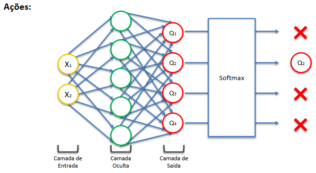

# Experiência de Replay

Nas imagens anteriores o agente está executando ações em um ambiente em que existem somente 2 estados possíveis X1 e X2 dentro de um plano cartesiado, onde X1 é o eixo x e X2 é o eixo y. Como é um ambiente com poucos estados, nos exemplos anteriores a rede neural está executando todo o processo de treinamento a cada mudança de estado.

Em outros problemas em que podem haver muitos estados, como é o exemplo de uma rede utilizada em carros autônomos, onde cada sensor representa um estado, haverão situações as quais o ambiente proporcionará momentos de monotonia para o agente com poucas mudanças significativas que demande todo um processo de treinamento. Isso pode gerar overffiting na rede.

Um exemplo para ilustrar isso é quando o carro estiver em uma reta sem obstáculos, nesse exemplo não é viável executar todo o processo de treinamento a cada mudança de estado, pois mudanças poucas significativas estão ocorrendo no ambiente para que isso ocorra. Além disso o agente poderá ficar muito bom em trafegar em retas (overffiting) e quando encontrar algo diferente não tomar boas decisões. Desse modo é interessante que o processo de treinamento ocorra em períodos de tempos mais espaçados, pois é sabido que o treinamento pode ser demorado e não é a todo momento que há uma curva ou surge algum obstáculo que necessite a tomada de decisão do agente.

Portando a rede receberá amostras do ambiente (batch_size) e não do ambiente inteiro para o treinamento.

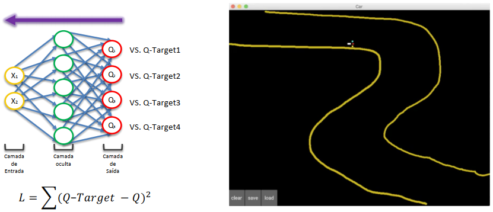